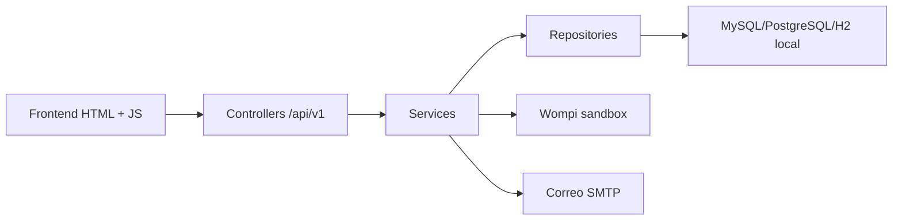
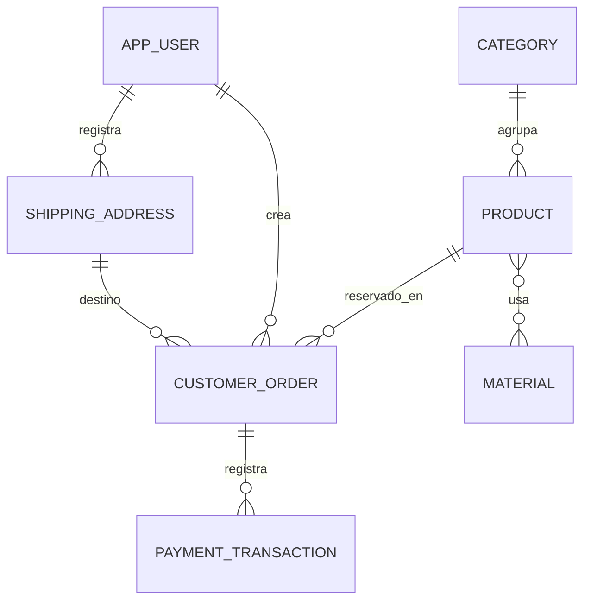

# Arquitectura tecnica de Macondo Jewelry

## Capas

La responsabilidad de cada capa es:

- Controller: recibe HTTP, valida DTOs y delega. No contiene reglas de negocio.
- Controller/dto/request y Controller/dto/response: define contratos separados para entrada y salida de la API.
- Service: contiene reglas del dominio: reserva, calculo de comision, cambio de estados, autorizacion por propietario.
- Repository: usa Spring Data JPA para consultar y persistir entidades.
- Entity: agrupa entidades JPA y enums del dominio.
- DTO/Mapper: separa contratos HTTP de entidades JPA. Los mappers son MapStruct.
- Integration: agrupa Wompi y correo SMTP.
- Common: centraliza excepciones y errores REST.

## Entidades

Entidades de negocio:

- `Product`: joya vendible, con precio, imagen, estado y version para bloqueo optimista.
- `Category`: clasifica piezas como anillos o manillas.
- `Material`: materiales usados en una pieza; relacion muchos a muchos con producto.
- `CustomerOrder`: pedido con referencia unica y estados de negocio.
- `ShippingAddress`: datos de envio capturados al iniciar compra.
- `PaymentTransaction`: evento recibido desde Wompi para auditoria e idempotencia.

`AppUser` soporta seguridad y roles `CLIENTE`/`ADMIN`.

## Flujo transaccional

1. Cliente autenticado solicita `POST /api/v1/pagos/crear`.
2. `PaymentService` consulta producto y calcula comision.
3. `OrderService` reserva producto con TTL de 8 minutos y crea pedido pendiente.
4. `WompiSignatureService` firma la referencia para el widget.
5. Frontend abre widget Wompi con los datos devueltos por el backend.
6. Wompi envia webhook.
7. Backend valida `X-Event-Checksum` usando `signature.properties`, `timestamp` y el secreto de eventos.
8. Backend registra `PaymentTransaction` y actualiza pedido/producto.

## Estados

Producto:

- `AVAILABLE`: se puede comprar.
- `RESERVED`: bloqueado temporalmente durante pago.
- `SOLD`: pago aprobado.
- `INACTIVE`: oculto o desactivado por admin.

Pedido:

- `PENDING_PAYMENT`: esperando respuesta de Wompi.
- `APPROVED`: pago aprobado.
- `FAILED_PAYMENT`: pago rechazado/anulado.
- `CANCELLED`: reserva expirada.
- `SHIPPED`: enviado.
- `DELIVERED`: entregado.

## Seguridad

- Login y registro publicos.
- Catalogo publico.
- Pedidos y pagos requieren JWT.
- `/api/v1/admin/**` requiere rol `ADMIN`.
- Passwords con BCrypt factor 10.
- JWT firmado con HMAC-SHA256.

## Despliegue

- Backend: Render/Railway/Fly/Koyeb con Java 21, Dockerfile y base PostgreSQL.
- Frontend: Vercel usando carpeta `public`.
- `vercel.json` reenvia `/api/**` al backend HTTPS.
- Wompi requiere que el webhook publicado use HTTPS.
